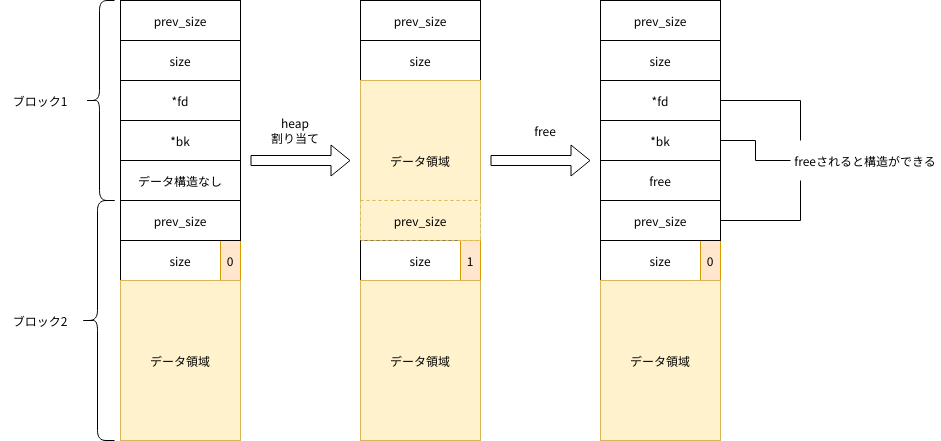
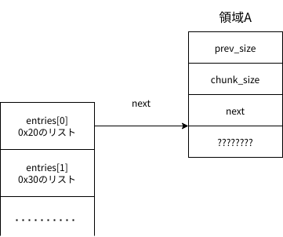
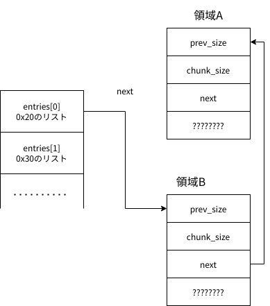
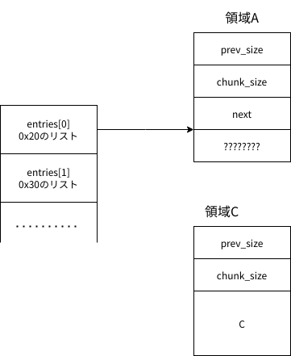

<!-- footer:  -->

### heap勉強会
* mallocやfreeに関して学ぶ
* `INTERNAL_SIZE_T prev_size`
* `INTERNAL_SIZE_T size`
* INTERNAL_SIZE_T, SIZE_SZは64bit環境の場合は64bit
* 32bit環境の場合は32bit
* reallocやcallocについては触れない

---
### 参考資料
* https://faraz.faith/2019-10-12-picoctf-2019-heap-challs/
* https://ctf-wiki.github.io/ctf-wiki/pwn/linux/glibc-heap/heap_structure/
* ptr-yudaiさんのCTFするぞやwrite-up
* https://furutsuki.hatenablog.com/entry/2019/02/26/112207
* https://sploitfun.wordpress.com/2015/02/10/understanding-glibc-malloc/
* ももいろテクノロジーの記事

---
### 目次
* heap構造を学ぶ
* heapの攻撃について学ぶ

---
### heap領域はどこ？

---
### free時のデータ構造

---
### malloc時のデータ構造

---

---
### free listはこんなに単純？
* 実は数種類ある
	* t-cache
	* fast bin
	* small bin(あまり重要でなさそう)
	* large bin(あまり重要でなさそう)
	* unsorted bin

---
### t-cache
* glibc 2.26から追加されたもの
	* スレッド毎のキャッシュ
	* 排他制御の必要がないので高速
* 64bitだと`TCACHE_MAX_BINS`(binの種類)は64になっている
	* キャッシュサイズは0x18, 0x28, 0x38, ... 0x408バイト以下というように区切られている
	* リンクリストの長さは`TCACHE_FILL_COUNT`によって制限されていて7になっている
	
---
### t-cache
* Aを0x10でmallocする
* Bを0x10でmallocする
* Aをfreeする
* Bをfreeする
* Cを0x10でmallocする
* この場合どんな感じになるか

---
### t-cache

---
### t-cache

---
### t-cache

---
### fast bin
* 小さなメモリブロックをmallocしてはfreeするという処理がよくある
	* マウスの移動など
* 普通freeリストで隣接している部分はくっつける
* ↑の条件だと, これは効率が悪い
	* 隣接部分をくっつける
		* 中間チェック
	* mallocの際に切り分ける
	* を繰り返す
* なのでくっつける作業をしない

---
### fast bin
* デフォルトで最大チャンクサイズは0x80バイト
* 10個のbinを確保できる
* LIFO
* 単方向リスト
* mallocする際に対応するブロックがあるかどうか判断する
	* 多分t-cacheの次に探す
* malloc時に次のブロック0x~ - 0x8をチャンクサイズとしてインデックスを計算するチェックが入る

---
### small bin
* 62個のチャンク
	* 0x20, 0x30, ... 0x3f0バイト毎
	* 2*SIZE_ST*x
* FIFO
* 双方向リスト
* 隣りがfreed chunkだとくっつける

---
### small bin

---
### large bin
* 0x400バイト以上chunkが対数スケールのサイズ範囲ごとに振り分けられる
* FIFO
* 双方向リスト
* 隣接したchunkはくっつける

---
### unsorted bin
* free後すぐに同じ大きさのmallocが呼ばれやすいことから作られた
* small binやlarge binに入る前に一度unsorted binに入れる
* FIFO

---

---
### mmap 
* large bin以上に大きいサイズを取る場合に使う
* 本来はファイルをメモリにマップするsyscallらしい
* デフォルトで128K以上はmmapでkernelから取得する
* このときfreeするとfreelistには繋がらずに, 直接munmapでkernelに返却する

---
### arena
* 今まで言ってた話はすべてmain_arenaの話
* シングルスレッドならこれだけで良い
* マルチスレッドならそれぞれでheap領域が欲しいが...
	* それぞれがheapをどれだけ使うのかわからない
	* スレッド数がわからない
	* 無理
* ロック競合が起こるまではmain_arenaを用いる
* ロックが取れないときmmapでスレッド用arenaを作成

---
### 攻撃手法

---
### 攻撃手法
* heap overflow
* use after free
* double free

---
### heap overflow
* stack buffer overflowと起きてることは同じ
	* 書き込み先がheap領域
	* return addressがheap上にはない
		* 直接RIPを取るのは無理

---
### できる可能性のある関数
* `\n`で止まる
	* gtes
	* scanf
	* vscanf
* `\x00`で止まる
	* strcpy
	* sprintf
	* strcat
* とかね

---
### use after free
* freeされている領域に書き込みを行える場合がある
	* チャンク構造の破壊
* もしくは読み出し
	* 読み出すメリットあんまないかもー

---
### double free
* 同じ領域のチャンクを生成する 
* その後mallocすることで一方はfree listにある状態でもう一方はusedの状態になる
* チャンク構造の破壊ができる
* 現在はtcache以外はチェックが入る

---
### どうやって悪用するんや？

---
### ここからはテクニック的なもの
* 実際どうやって悪用するのか知りたい人用
* tcache *
* unlink attack
* house of *

---
### tcache *
* tcache poisoning
* tcache dup
* tcache perthread corruption
* tcache house of spirit

---
### tcache poisoning
* tcacheのnext部分を何らかの形で書き換える
* これによって任意の場所をmallocさせることができる
* 任意の場所を書き換えることができる
	* GOT overwriteなどが可能
* tcache poisoningは同じ大きさのリストにのみ適応される

---
### tcache dup
* tcacheはdouble freeのチェックが入らない
* double freeでできるものはできる
	* fast binとかより楽

---
### tcache perthread corruction
* tcacheはスレッド毎に確保される
	* tcache_perthread_structという構造体で管理されている
* tcache poisoningなどを利用して↑の構造体を書き換える
* スレッドのtcache全体を制御することができる
* ↑の構造体はheap領域にある

---
### tcache house of spirit
* 元々house of spiritという攻撃がある
* それのtcache版
	* tcacheはチェックがないので楽
* mallocで確保している領域のポインタをどうにかして変える
* それができれば任意の場所をmallocさせることができる
	* tcacheでなければnext-0x8などのチェック

---
### unlink attack

---
### テクニック
* `__free_hook`
	* freeするときに実行する関数を指定できる

